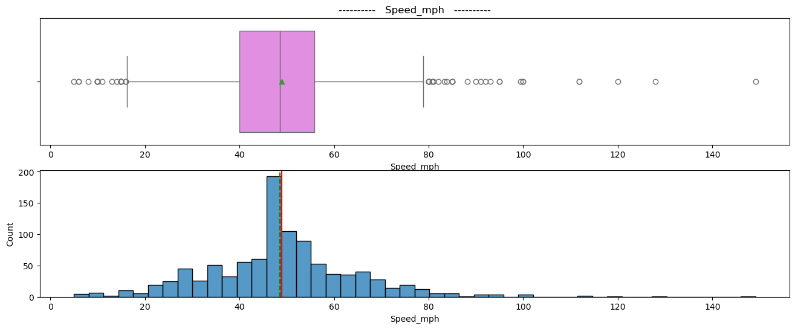
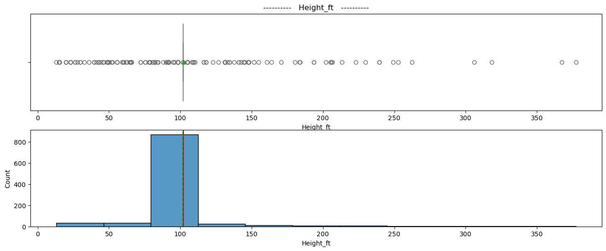
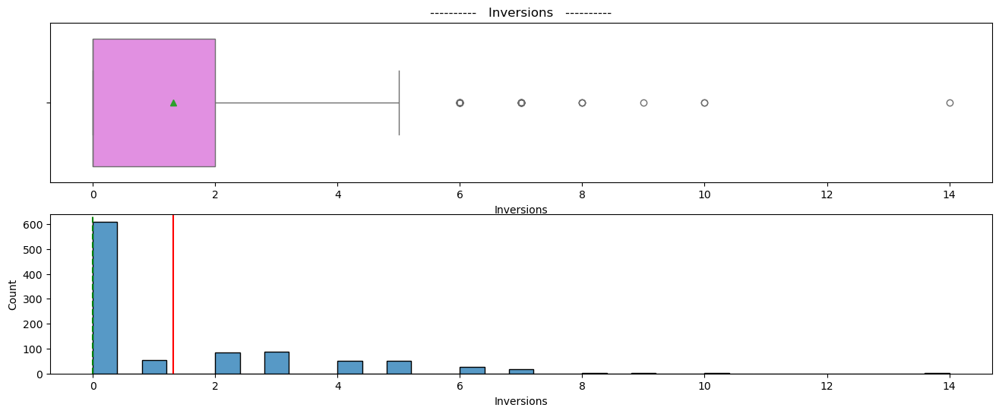
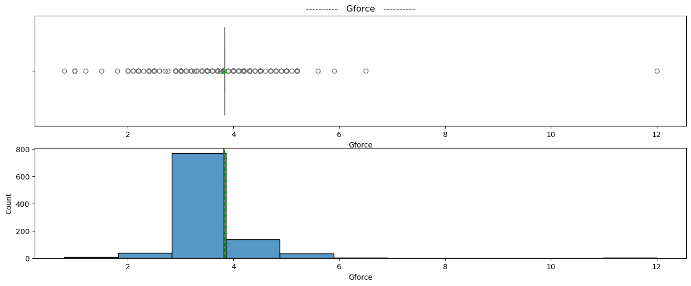
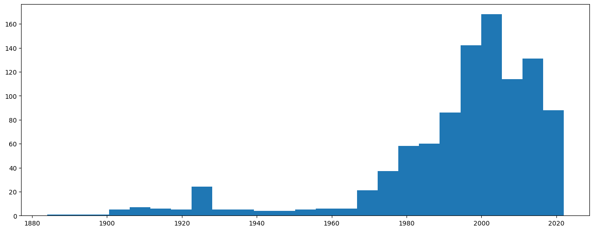
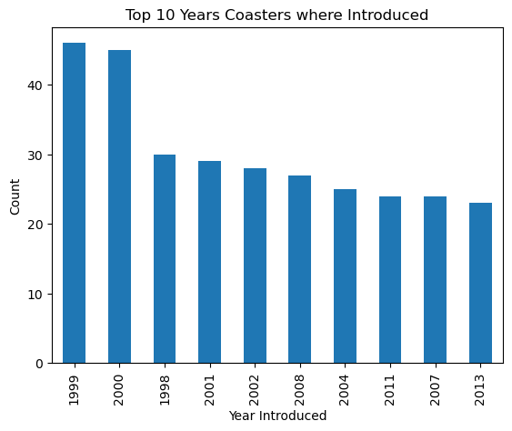
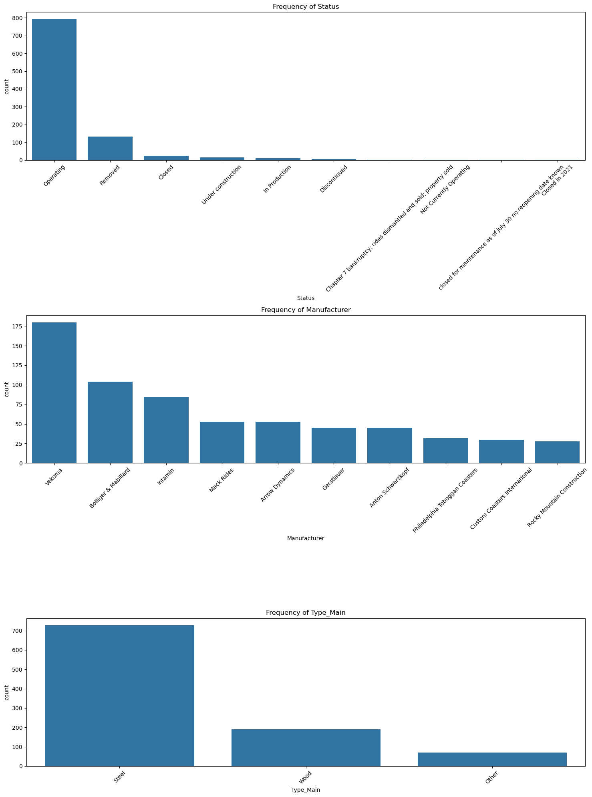
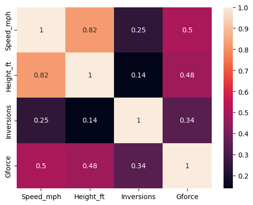
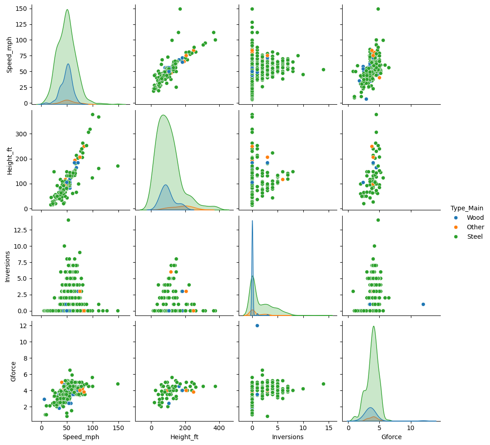

## About the Data


### Introduction

The dataset used in this analysis provides comprehensive information about various roller coasters from around the world. It includes attributes such as speed, height, location, manufacturer, and status (e.g., operating, removed, closed). This rich dataset allows us to explore trends, identify the characteristics of the fastest and tallest roller coasters, and analyze the contributions of different manufacturers to the roller coaster industry.


### Data Description

The dataset consists of the following key attributes:

- **Coaster Name**: The name of the roller coaster.
- **Length**: The length of the roller coaster track.
- **Speed**: The speed of the roller coaster, including both mph and km/h values.
- **Location**: The geographic location where the roller coaster is or was situated.
- **Status**: The current operational status of the roller coaster (e.g., operating, removed, closed).
- **Opening Date**: The date when the roller coaster was opened to the public.
- **Type**: The type of roller coaster (e.g., wood, steel).
- **Manufacturer**: The company that designed and built the roller coaster.
- **Height_ft**: The height restriction for riders.
- **Model**: The specific model or design of the roller coaster.
- **Inversions**: The number of inversions or loops in the roller coaster track.
- **G-Force**: The maximum g-force experienced by riders on the roller coaster.

### Initial Data Exploration

Upon initial examination, the dataset contains some irregularities and missing values that need to be addressed before conducting any detailed analysis. Some of the challenges observed include:

- Inconsistent speed measurements, such as mixed units (mph and km/h) and irregular entries (e.g., "35[1] mph (56 km/h)").
- Missing data in key columns such as speed, height, and manufacturer.
- Variations in how certain attributes are recorded, requiring standardization.

### Data Cleaning and Processing

To ensure the accuracy of our analysis, the following steps were undertaken to clean and standardize the data:

- Handling missing values by either imputing or removing incomplete entries.
- Converting speed measurements to a uniform unit (mph) to facilitate accurate comparisons.
- Correcting irregular entries in the data to maintain consistency.

### Exploratory Data Analysis (EDA)

The EDA process included visualizing key attributes, identifying trends over time, and comparing different types of roller coasters. Specific analyses included:

- Trends in roller coaster speed and height over the years.
- Differences in characteristics between wooden and steel roller coasters.
- Identifying top manufacturers based on the speed and height of their roller coasters.
- Analyzing the distribution of roller coaster statuses across various locations.

By leveraging this dataset, we aim to gain valuable insights into the evolution and current state of roller coasters worldwide, shedding light on the factors that contribute to the design and popularity of these thrilling attractions.


# Import necessary libraries


```python
import pandas as pd
import numpy as np
import matplotlib.pyplot as plt
import seaborn as sns


pd.set_option('display.max_columns', 200)
```

# Load in the Data


```python
df = pd.read_csv('./data/coaster_db.csv')
```

# Basic Data Understanding


```python
df.shape
```


    (1087, 56)


```python
df.info()
```

    <class 'pandas.core.frame.DataFrame'>
    RangeIndex: 1087 entries, 0 to 1086
    Data columns (total 56 columns):
     #   Column                         Non-Null Count  Dtype  
    ---  ------                         --------------  -----  
     0   coaster_name                   1087 non-null   object 
     1   Length                         953 non-null    object 
     2   Speed                          937 non-null    object 
     3   Location                       1087 non-null   object 
     4   Status                         874 non-null    object 
     5   Opening date                   837 non-null    object 
     6   Type                           1087 non-null   object 
     7   Manufacturer                   1028 non-null   object 
     8   Height restriction             831 non-null    object 
     9   Model                          744 non-null    object 
     10  Height                         965 non-null    object 
     11  Inversions                     932 non-null    float64
     12  Lift/launch system             795 non-null    object 
     13  Cost                           382 non-null    object 
     14  Trains                         718 non-null    object 
     15  Park section                   487 non-null    object 
     16  Duration                       765 non-null    object 
     17  Capacity                       575 non-null    object 
     18  G-force                        362 non-null    object 
     19  Designer                       578 non-null    object 
     20  Max vertical angle             357 non-null    object 
     21  Drop                           494 non-null    object 
     22  Soft opening date              96 non-null     object 
     23  Fast Lane available            69 non-null     object 
     24  Replaced                       173 non-null    object 
     25  Track layout                   335 non-null    object 
     26  Fastrack available             19 non-null     object 
     27  Soft opening date.1            96 non-null     object 
     28  Closing date                   236 non-null    object 
     29  Opened                         27 non-null     object 
     30  Replaced by                    88 non-null     object 
     31  Website                        87 non-null     object 
     32  Flash Pass Available           50 non-null     object 
     33  Must transfer from wheelchair  106 non-null    object 
     34  Theme                          44 non-null     object 
     35  Single rider line available    81 non-null     object 
     36  Restraint Style                22 non-null     object 
     37  Flash Pass available           46 non-null     object 
     38  Acceleration                   60 non-null     object 
     39  Restraints                     24 non-null     object 
     40  Name                           35 non-null     object 
     41  year_introduced                1087 non-null   int64  
     42  latitude                       812 non-null    float64
     43  longitude                      812 non-null    float64
     44  Type_Main                      1087 non-null   object 
     45  opening_date_clean             837 non-null    object 
     46  speed1                         937 non-null    object 
     47  speed2                         935 non-null    object 
     48  speed1_value                   937 non-null    float64
     49  speed1_unit                    937 non-null    object 
     50  speed_mph                      937 non-null    float64
     51  height_value                   965 non-null    float64
     52  height_unit                    965 non-null    object 
     53  height_ft                      171 non-null    float64
     54  Inversions_clean               1087 non-null   int64  
     55  Gforce_clean                   362 non-null    float64
    dtypes: float64(8), int64(2), object(46)
    memory usage: 475.7+ KB
    


```python
df.head() 
```


<div>

<table border="1" class="dataframe">
  <thead>
    <tr style="text-align: right;">
      <th></th>
      <th>coaster_name</th>
      <th>Length</th>
      <th>Speed</th>
      <th>Location</th>
      <th>Status</th>
      <th>Opening date</th>
      <th>Type</th>
      <th>Manufacturer</th>
      <th>Height restriction</th>
      <th>Model</th>
      <th>Height</th>
      <th>Inversions</th>
      <th>Lift/launch system</th>
      <th>Cost</th>
      <th>Trains</th>
      <th>Park section</th>
      <th>Duration</th>
      <th>Capacity</th>
      <th>G-force</th>
      <th>Designer</th>
      <th>Max vertical angle</th>
      <th>Drop</th>
      <th>Soft opening date</th>
      <th>Fast Lane available</th>
      <th>Replaced</th>
      <th>Track layout</th>
      <th>Fastrack available</th>
      <th>Soft opening date.1</th>
      <th>Closing date</th>
      <th>Opened</th>
      <th>Replaced by</th>
      <th>Website</th>
      <th>Flash Pass Available</th>
      <th>Must transfer from wheelchair</th>
      <th>Theme</th>
      <th>Single rider line available</th>
      <th>Restraint Style</th>
      <th>Flash Pass available</th>
      <th>Acceleration</th>
      <th>Restraints</th>
      <th>Name</th>
      <th>year_introduced</th>
      <th>latitude</th>
      <th>longitude</th>
      <th>Type_Main</th>
      <th>opening_date_clean</th>
      <th>speed1</th>
      <th>speed2</th>
      <th>speed1_value</th>
      <th>speed1_unit</th>
      <th>speed_mph</th>
      <th>height_value</th>
      <th>height_unit</th>
      <th>height_ft</th>
      <th>Inversions_clean</th>
      <th>Gforce_clean</th>
    </tr>
  </thead>
  <tbody>
    <tr>
      <th>0</th>
      <td>Switchback Railway</td>
      <td>600 ft (180 m)</td>
      <td>6 mph (9.7 km/h)</td>
      <td>Coney Island</td>
      <td>Removed</td>
      <td>June 16, 1884</td>
      <td>Wood</td>
      <td>LaMarcus Adna Thompson</td>
      <td>NaN</td>
      <td>Lift Packed</td>
      <td>50 ft (15 m)</td>
      <td>NaN</td>
      <td>gravity</td>
      <td>NaN</td>
      <td>NaN</td>
      <td>Coney Island Cyclone Site</td>
      <td>1:00</td>
      <td>1600 riders per hour</td>
      <td>2.9</td>
      <td>LaMarcus Adna Thompson</td>
      <td>30°</td>
      <td>43 ft (13 m)</td>
      <td>NaN</td>
      <td>NaN</td>
      <td>NaN</td>
      <td>Gravity pulled coaster</td>
      <td>NaN</td>
      <td>NaN</td>
      <td>NaN</td>
      <td>NaN</td>
      <td>NaN</td>
      <td>NaN</td>
      <td>NaN</td>
      <td>NaN</td>
      <td>NaN</td>
      <td>NaN</td>
      <td>NaN</td>
      <td>NaN</td>
      <td>NaN</td>
      <td>NaN</td>
      <td>NaN</td>
      <td>1884</td>
      <td>40.5740</td>
      <td>-73.9780</td>
      <td>Wood</td>
      <td>1884-06-16</td>
      <td>6 mph</td>
      <td>9.7 km/h</td>
      <td>6.0</td>
      <td>mph</td>
      <td>6.0</td>
      <td>50.0</td>
      <td>ft</td>
      <td>NaN</td>
      <td>0</td>
      <td>2.9</td>
    </tr>
    <tr>
      <th>1</th>
      <td>Flip Flap Railway</td>
      <td>NaN</td>
      <td>NaN</td>
      <td>Sea Lion Park</td>
      <td>Removed</td>
      <td>1895</td>
      <td>Wood</td>
      <td>Lina Beecher</td>
      <td>NaN</td>
      <td>NaN</td>
      <td>NaN</td>
      <td>1.0</td>
      <td>NaN</td>
      <td>NaN</td>
      <td>a single car. Riders are arranged 1 across in ...</td>
      <td>NaN</td>
      <td>NaN</td>
      <td>NaN</td>
      <td>12</td>
      <td>Lina Beecher</td>
      <td>NaN</td>
      <td>NaN</td>
      <td>NaN</td>
      <td>NaN</td>
      <td>NaN</td>
      <td>NaN</td>
      <td>NaN</td>
      <td>NaN</td>
      <td>1902</td>
      <td>NaN</td>
      <td>NaN</td>
      <td>NaN</td>
      <td>NaN</td>
      <td>NaN</td>
      <td>NaN</td>
      <td>NaN</td>
      <td>NaN</td>
      <td>NaN</td>
      <td>NaN</td>
      <td>NaN</td>
      <td>NaN</td>
      <td>1895</td>
      <td>40.5780</td>
      <td>-73.9790</td>
      <td>Wood</td>
      <td>1895-01-01</td>
      <td>NaN</td>
      <td>NaN</td>
      <td>NaN</td>
      <td>NaN</td>
      <td>NaN</td>
      <td>NaN</td>
      <td>NaN</td>
      <td>NaN</td>
      <td>1</td>
      <td>12.0</td>
    </tr>
    <tr>
      <th>2</th>
      <td>Switchback Railway (Euclid Beach Park)</td>
      <td>NaN</td>
      <td>NaN</td>
      <td>Cleveland, Ohio, United States</td>
      <td>Closed</td>
      <td>NaN</td>
      <td>Other</td>
      <td>NaN</td>
      <td>NaN</td>
      <td>NaN</td>
      <td>NaN</td>
      <td>NaN</td>
      <td>NaN</td>
      <td>NaN</td>
      <td>NaN</td>
      <td>NaN</td>
      <td>NaN</td>
      <td>NaN</td>
      <td>NaN</td>
      <td>NaN</td>
      <td>NaN</td>
      <td>NaN</td>
      <td>NaN</td>
      <td>NaN</td>
      <td>NaN</td>
      <td>NaN</td>
      <td>NaN</td>
      <td>NaN</td>
      <td>NaN</td>
      <td>1895</td>
      <td>NaN</td>
      <td>NaN</td>
      <td>NaN</td>
      <td>NaN</td>
      <td>NaN</td>
      <td>NaN</td>
      <td>NaN</td>
      <td>NaN</td>
      <td>NaN</td>
      <td>NaN</td>
      <td>NaN</td>
      <td>1896</td>
      <td>41.5800</td>
      <td>-81.5700</td>
      <td>Other</td>
      <td>NaN</td>
      <td>NaN</td>
      <td>NaN</td>
      <td>NaN</td>
      <td>NaN</td>
      <td>NaN</td>
      <td>NaN</td>
      <td>NaN</td>
      <td>NaN</td>
      <td>0</td>
      <td>NaN</td>
    </tr>
    <tr>
      <th>3</th>
      <td>Loop the Loop (Coney Island)</td>
      <td>NaN</td>
      <td>NaN</td>
      <td>Other</td>
      <td>Removed</td>
      <td>1901</td>
      <td>Steel</td>
      <td>Edwin Prescott</td>
      <td>NaN</td>
      <td>NaN</td>
      <td>NaN</td>
      <td>1.0</td>
      <td>NaN</td>
      <td>NaN</td>
      <td>a single car. Riders are arranged 2 across in ...</td>
      <td>NaN</td>
      <td>NaN</td>
      <td>NaN</td>
      <td>NaN</td>
      <td>Edward A. Green</td>
      <td>NaN</td>
      <td>NaN</td>
      <td>NaN</td>
      <td>NaN</td>
      <td>Switchback Railway</td>
      <td>NaN</td>
      <td>NaN</td>
      <td>NaN</td>
      <td>1910</td>
      <td>NaN</td>
      <td>Giant Racer</td>
      <td>NaN</td>
      <td>NaN</td>
      <td>NaN</td>
      <td>NaN</td>
      <td>NaN</td>
      <td>NaN</td>
      <td>NaN</td>
      <td>NaN</td>
      <td>NaN</td>
      <td>NaN</td>
      <td>1901</td>
      <td>40.5745</td>
      <td>-73.9780</td>
      <td>Steel</td>
      <td>1901-01-01</td>
      <td>NaN</td>
      <td>NaN</td>
      <td>NaN</td>
      <td>NaN</td>
      <td>NaN</td>
      <td>NaN</td>
      <td>NaN</td>
      <td>NaN</td>
      <td>1</td>
      <td>NaN</td>
    </tr>
    <tr>
      <th>4</th>
      <td>Loop the Loop (Young's Pier)</td>
      <td>NaN</td>
      <td>NaN</td>
      <td>Other</td>
      <td>Removed</td>
      <td>1901</td>
      <td>Steel</td>
      <td>Edwin Prescott</td>
      <td>NaN</td>
      <td>NaN</td>
      <td>NaN</td>
      <td>1.0</td>
      <td>NaN</td>
      <td>NaN</td>
      <td>NaN</td>
      <td>NaN</td>
      <td>NaN</td>
      <td>NaN</td>
      <td>NaN</td>
      <td>Edward A. Green</td>
      <td>NaN</td>
      <td>NaN</td>
      <td>NaN</td>
      <td>NaN</td>
      <td>NaN</td>
      <td>NaN</td>
      <td>NaN</td>
      <td>NaN</td>
      <td>1912</td>
      <td>NaN</td>
      <td>NaN</td>
      <td>NaN</td>
      <td>NaN</td>
      <td>NaN</td>
      <td>NaN</td>
      <td>NaN</td>
      <td>NaN</td>
      <td>NaN</td>
      <td>NaN</td>
      <td>NaN</td>
      <td>NaN</td>
      <td>1901</td>
      <td>39.3538</td>
      <td>-74.4342</td>
      <td>Steel</td>
      <td>1901-01-01</td>
      <td>NaN</td>
      <td>NaN</td>
      <td>NaN</td>
      <td>NaN</td>
      <td>NaN</td>
      <td>NaN</td>
      <td>NaN</td>
      <td>NaN</td>
      <td>1</td>
      <td>NaN</td>
    </tr>
  </tbody>
</table>
</div>


```python
df.describe().T
```


<div>

<table border="1" class="dataframe">
  <thead>
    <tr style="text-align: right;">
      <th></th>
      <th>count</th>
      <th>mean</th>
      <th>std</th>
      <th>min</th>
      <th>25%</th>
      <th>50%</th>
      <th>75%</th>
      <th>max</th>
    </tr>
  </thead>
  <tbody>
    <tr>
      <th>Inversions</th>
      <td>932.0</td>
      <td>1.547210</td>
      <td>2.114073</td>
      <td>0.0000</td>
      <td>0.00000</td>
      <td>0.0000</td>
      <td>3.0000</td>
      <td>14.0000</td>
    </tr>
    <tr>
      <th>year_introduced</th>
      <td>1087.0</td>
      <td>1994.986201</td>
      <td>23.475248</td>
      <td>1884.0000</td>
      <td>1989.00000</td>
      <td>2000.0000</td>
      <td>2010.0000</td>
      <td>2022.0000</td>
    </tr>
    <tr>
      <th>latitude</th>
      <td>812.0</td>
      <td>38.373484</td>
      <td>15.516596</td>
      <td>-48.2617</td>
      <td>35.03105</td>
      <td>40.2898</td>
      <td>44.7996</td>
      <td>63.2309</td>
    </tr>
    <tr>
      <th>longitude</th>
      <td>812.0</td>
      <td>-41.595373</td>
      <td>72.285227</td>
      <td>-123.0357</td>
      <td>-84.55220</td>
      <td>-76.6536</td>
      <td>2.7781</td>
      <td>153.4265</td>
    </tr>
    <tr>
      <th>speed1_value</th>
      <td>937.0</td>
      <td>53.850374</td>
      <td>23.385518</td>
      <td>5.0000</td>
      <td>40.00000</td>
      <td>50.0000</td>
      <td>63.0000</td>
      <td>240.0000</td>
    </tr>
    <tr>
      <th>speed_mph</th>
      <td>937.0</td>
      <td>48.617289</td>
      <td>16.678031</td>
      <td>5.0000</td>
      <td>37.30000</td>
      <td>49.7000</td>
      <td>58.0000</td>
      <td>149.1000</td>
    </tr>
    <tr>
      <th>height_value</th>
      <td>965.0</td>
      <td>89.575171</td>
      <td>136.246444</td>
      <td>4.0000</td>
      <td>44.00000</td>
      <td>79.0000</td>
      <td>113.0000</td>
      <td>3937.0000</td>
    </tr>
    <tr>
      <th>height_ft</th>
      <td>171.0</td>
      <td>101.996491</td>
      <td>67.329092</td>
      <td>13.1000</td>
      <td>51.80000</td>
      <td>91.2000</td>
      <td>131.2000</td>
      <td>377.3000</td>
    </tr>
    <tr>
      <th>Inversions_clean</th>
      <td>1087.0</td>
      <td>1.326587</td>
      <td>2.030854</td>
      <td>0.0000</td>
      <td>0.00000</td>
      <td>0.0000</td>
      <td>2.0000</td>
      <td>14.0000</td>
    </tr>
    <tr>
      <th>Gforce_clean</th>
      <td>362.0</td>
      <td>3.824006</td>
      <td>0.989998</td>
      <td>0.8000</td>
      <td>3.40000</td>
      <td>4.0000</td>
      <td>4.5000</td>
      <td>12.0000</td>
    </tr>
  </tbody>
</table>
</div>


# Data Preperation

## Dimensionality Reduction

Data has many redudnant columns let's subset data for unique captures of information and the most important columns.


```python
df = df[['coaster_name',
#'Length', 'Speed',
'Location', 'Status',
#'Opening date',
# 'Type',
'Manufacturer',
#'Height restriction', 'Model', 'Height',
#'Inversions', 'Lift/launch system', 'Cost', 'Trains', 'Park section',
#'Duration', 'Capacity', 'G-force', 'Designer', 'Max vertical angle',
#'Drop', 'Soft opening date', 'Fast Lane available', 'Replaced',
#'Track layout', 'Fastrack available', 'Soft opening date.1',
#'Closing date',
#'Opened', 
#'Replaced by', 'Website',
#'Flash Pass Available', 'Must transfer from wheelchair', 'Theme',
#'Single rider line available', 'Restraint Style',
#'Flash Pass available', 'Acceleration', 'Restraints', 'Name',
'year_introduced',
'latitude', 'longitude',
'Type_Main',
'opening_date_clean',
#'speed1', 'speed2', 'speed1_value', 'speed1_unit',
'speed_mph', 
#'height_value', 'height_unit',
'height_ft',
'Inversions_clean', 'Gforce_clean']].copy()
```


```python
df.shape
```


    (1087, 13)


```python
df.info()
```

    <class 'pandas.core.frame.DataFrame'>
    RangeIndex: 1087 entries, 0 to 1086
    Data columns (total 13 columns):
     #   Column              Non-Null Count  Dtype  
    ---  ------              --------------  -----  
     0   coaster_name        1087 non-null   object 
     1   Location            1087 non-null   object 
     2   Status              874 non-null    object 
     3   Manufacturer        1028 non-null   object 
     4   year_introduced     1087 non-null   int64  
     5   latitude            812 non-null    float64
     6   longitude           812 non-null    float64
     7   Type_Main           1087 non-null   object 
     8   opening_date_clean  837 non-null    object 
     9   speed_mph           937 non-null    float64
     10  height_ft           171 non-null    float64
     11  Inversions_clean    1087 non-null   int64  
     12  Gforce_clean        362 non-null    float64
    dtypes: float64(5), int64(2), object(6)
    memory usage: 110.5+ KB
    

## Data Type conversion

```opening_data_clean``` seems to be captured as a float64, let's convert that to a datetime object.


```python
df['opening_date_clean'] = pd.to_datetime(df['opening_date_clean'])
```

## Column formatting

Columns in dataset don't look consistently formatted or easily readable.


```python
df.columns
```


    Index(['coaster_name', 'Location', 'Status', 'Manufacturer', 'year_introduced',
           'latitude', 'longitude', 'Type_Main', 'opening_date_clean', 'speed_mph',
           'height_ft', 'Inversions_clean', 'Gforce_clean'],
          dtype='object')


```python
df = df.rename(columns={'coaster_name':'Coaster_name',
                   'year_introduced':'Year_Introduced',
                   'latitude':'Latitude',
                   'longitude':'Longitude',
                   'opening_date_clean':'Opening_Date',
                   'speed_mph':'Speed_mph',
                   'height_ft':'Height_ft',
                   'Inversions_clean':'Inversions',
                   'Gforce_clean':'Gforce'})
```


```python
df.columns
```


    Index(['Coaster_name', 'Location', 'Status', 'Manufacturer', 'Year_Introduced',
           'Latitude', 'Longitude', 'Type_Main', 'Opening_Date', 'Speed_mph',
           'Height_ft', 'Inversions', 'Gforce'],
          dtype='object')


## Missing Values


```python
df.info()
```

    <class 'pandas.core.frame.DataFrame'>
    RangeIndex: 1087 entries, 0 to 1086
    Data columns (total 13 columns):
     #   Column           Non-Null Count  Dtype         
    ---  ------           --------------  -----         
     0   Coaster_name     1087 non-null   object        
     1   Location         1087 non-null   object        
     2   Status           874 non-null    object        
     3   Manufacturer     1028 non-null   object        
     4   Year_Introduced  1087 non-null   int64         
     5   Latitude         812 non-null    float64       
     6   Longitude        812 non-null    float64       
     7   Type_Main        1087 non-null   object        
     8   Opening_Date     837 non-null    datetime64[ns]
     9   Speed_mph        937 non-null    float64       
     10  Height_ft        171 non-null    float64       
     11  Inversions       1087 non-null   int64         
     12  Gforce           362 non-null    float64       
    dtypes: datetime64[ns](1), float64(5), int64(2), object(5)
    memory usage: 110.5+ KB
    


```python
df.isnull().sum()
```


    Coaster_name         0
    Location             0
    Status             213
    Manufacturer        59
    Year_Introduced      0
    Latitude           275
    Longitude          275
    Type_Main            0
    Opening_Date       250
    Speed_mph          150
    Height_ft          916
    Inversions           0
    Gforce             725
    dtype: int64


It looks like there are alot of missing values in our data. Let's impute any numerical columns with mean values, cateogrical columns with mode values, and datatime objects with linear interpolation.


```python
# Mean imputation
numerical_cols = df.select_dtypes(include=['number']).columns
df[numerical_cols] = df[numerical_cols].fillna(df[numerical_cols].mean())

# Mode imputation
categorical_cols = df.select_dtypes(include=['object']).columns
for col in categorical_cols:
    df[col] = df[col].fillna(df[col].mode()[0])

# Linear Interpolation
df['Opening_Date'] = df['Opening_Date'].ffill()
```


```python
df.isnull().sum()
```


    Coaster_name       0
    Location           0
    Status             0
    Manufacturer       0
    Year_Introduced    0
    Latitude           0
    Longitude          0
    Type_Main          0
    Opening_Date       0
    Speed_mph          0
    Height_ft          0
    Inversions         0
    Gforce             0
    dtype: int64


## Duplicated Rows


```python
df.loc[df.duplicated()]
```


<div>

<table border="1" class="dataframe">
  <thead>
    <tr style="text-align: right;">
      <th></th>
      <th>Coaster_name</th>
      <th>Location</th>
      <th>Status</th>
      <th>Manufacturer</th>
      <th>Year_Introduced</th>
      <th>Latitude</th>
      <th>Longitude</th>
      <th>Type_Main</th>
      <th>Opening_Date</th>
      <th>Speed_mph</th>
      <th>Height_ft</th>
      <th>Inversions</th>
      <th>Gforce</th>
    </tr>
  </thead>
  <tbody>
  </tbody>
</table>
</div>


Noted no duplicated rows but lets take a deeper look and look at duplicated ```Coaster_name```'s.


```python
df.loc[df.duplicated(subset=['Coaster_name'])]
```


<div>

<table border="1" class="dataframe">
  <thead>
    <tr style="text-align: right;">
      <th></th>
      <th>Coaster_name</th>
      <th>Location</th>
      <th>Status</th>
      <th>Manufacturer</th>
      <th>Year_Introduced</th>
      <th>Latitude</th>
      <th>Longitude</th>
      <th>Type_Main</th>
      <th>Opening_Date</th>
      <th>Speed_mph</th>
      <th>Height_ft</th>
      <th>Inversions</th>
      <th>Gforce</th>
    </tr>
  </thead>
  <tbody>
    <tr>
      <th>43</th>
      <td>Crystal Beach Cyclone</td>
      <td>Crystal Beach Park</td>
      <td>Removed</td>
      <td>Traver Engineering</td>
      <td>1927</td>
      <td>42.861700</td>
      <td>-79.059800</td>
      <td>Wood</td>
      <td>1926-01-01</td>
      <td>60.000000</td>
      <td>101.996491</td>
      <td>0</td>
      <td>4.000000</td>
    </tr>
    <tr>
      <th>60</th>
      <td>Derby Racer</td>
      <td>Revere Beach</td>
      <td>Removed</td>
      <td>Fred W. Pearce</td>
      <td>1937</td>
      <td>42.420000</td>
      <td>-70.986000</td>
      <td>Wood</td>
      <td>1911-01-01</td>
      <td>48.617289</td>
      <td>101.996491</td>
      <td>0</td>
      <td>3.824006</td>
    </tr>
    <tr>
      <th>61</th>
      <td>Blue Streak (Conneaut Lake)</td>
      <td>Conneaut Lake Park</td>
      <td>Closed</td>
      <td>Vekoma</td>
      <td>1938</td>
      <td>41.634900</td>
      <td>-80.318000</td>
      <td>Wood</td>
      <td>1938-05-23</td>
      <td>50.000000</td>
      <td>101.996491</td>
      <td>0</td>
      <td>3.824006</td>
    </tr>
    <tr>
      <th>167</th>
      <td>Big Thunder Mountain Railroad</td>
      <td>Other</td>
      <td>Operating</td>
      <td>Arrow Development (California and Florida)Dyna...</td>
      <td>1980</td>
      <td>38.373484</td>
      <td>-41.595373</td>
      <td>Steel</td>
      <td>1979-01-01</td>
      <td>35.000000</td>
      <td>101.996491</td>
      <td>0</td>
      <td>3.824006</td>
    </tr>
    <tr>
      <th>237</th>
      <td>Thunder Run (Canada's Wonderland)</td>
      <td>Canada's Wonderland</td>
      <td>Operating</td>
      <td>Mack Rides</td>
      <td>1986</td>
      <td>43.842700</td>
      <td>-79.542300</td>
      <td>Steel</td>
      <td>1981-05-23</td>
      <td>39.800000</td>
      <td>32.800000</td>
      <td>0</td>
      <td>3.824006</td>
    </tr>
    <tr>
      <th>...</th>
      <td>...</td>
      <td>...</td>
      <td>...</td>
      <td>...</td>
      <td>...</td>
      <td>...</td>
      <td>...</td>
      <td>...</td>
      <td>...</td>
      <td>...</td>
      <td>...</td>
      <td>...</td>
      <td>...</td>
    </tr>
    <tr>
      <th>1063</th>
      <td>Lil' Devil Coaster</td>
      <td>Six Flags Great Adventure</td>
      <td>Operating</td>
      <td>Zamperla</td>
      <td>2021</td>
      <td>40.134300</td>
      <td>-74.443400</td>
      <td>Steel</td>
      <td>1999-01-01</td>
      <td>48.617289</td>
      <td>101.996491</td>
      <td>0</td>
      <td>3.824006</td>
    </tr>
    <tr>
      <th>1064</th>
      <td>Little Dipper (Conneaut Lake Park)</td>
      <td>Conneaut Lake Park</td>
      <td>Operating</td>
      <td>Allan Herschell Company</td>
      <td>2021</td>
      <td>41.634300</td>
      <td>-80.316500</td>
      <td>Steel</td>
      <td>1950-01-01</td>
      <td>48.617289</td>
      <td>101.996491</td>
      <td>0</td>
      <td>3.824006</td>
    </tr>
    <tr>
      <th>1080</th>
      <td>Iron Gwazi</td>
      <td>Busch Gardens Tampa Bay</td>
      <td>Under construction</td>
      <td>Rocky Mountain Construction</td>
      <td>2022</td>
      <td>28.033900</td>
      <td>-82.423100</td>
      <td>Steel</td>
      <td>2022-02-01</td>
      <td>76.000000</td>
      <td>101.996491</td>
      <td>2</td>
      <td>3.824006</td>
    </tr>
    <tr>
      <th>1082</th>
      <td>American Dreier Looping</td>
      <td>Other</td>
      <td>Operating</td>
      <td>Anton Schwarzkopf</td>
      <td>2022</td>
      <td>38.373484</td>
      <td>-41.595373</td>
      <td>Steel</td>
      <td>2022-01-01</td>
      <td>53.000000</td>
      <td>101.996491</td>
      <td>3</td>
      <td>4.700000</td>
    </tr>
    <tr>
      <th>1084</th>
      <td>Tron Lightcycle Power Run</td>
      <td>Other</td>
      <td>Operating</td>
      <td>Vekoma</td>
      <td>2022</td>
      <td>38.373484</td>
      <td>-41.595373</td>
      <td>Steel</td>
      <td>2016-06-16</td>
      <td>59.300000</td>
      <td>101.996491</td>
      <td>0</td>
      <td>4.000000</td>
    </tr>
  </tbody>
</table>
<p>97 rows × 13 columns</p>
</div>


Let's look at the first three coaster names.


```python
df[df['Coaster_name'] == 'Crystal Beach Cyclone' ]
```


<div>

<table border="1" class="dataframe">
  <thead>
    <tr style="text-align: right;">
      <th></th>
      <th>Coaster_name</th>
      <th>Location</th>
      <th>Status</th>
      <th>Manufacturer</th>
      <th>Year_Introduced</th>
      <th>Latitude</th>
      <th>Longitude</th>
      <th>Type_Main</th>
      <th>Opening_Date</th>
      <th>Speed_mph</th>
      <th>Height_ft</th>
      <th>Inversions</th>
      <th>Gforce</th>
    </tr>
  </thead>
  <tbody>
    <tr>
      <th>39</th>
      <td>Crystal Beach Cyclone</td>
      <td>Crystal Beach Park</td>
      <td>Removed</td>
      <td>Traver Engineering</td>
      <td>1926</td>
      <td>42.8617</td>
      <td>-79.0598</td>
      <td>Wood</td>
      <td>1926-01-01</td>
      <td>60.0</td>
      <td>101.996491</td>
      <td>0</td>
      <td>4.0</td>
    </tr>
    <tr>
      <th>43</th>
      <td>Crystal Beach Cyclone</td>
      <td>Crystal Beach Park</td>
      <td>Removed</td>
      <td>Traver Engineering</td>
      <td>1927</td>
      <td>42.8617</td>
      <td>-79.0598</td>
      <td>Wood</td>
      <td>1926-01-01</td>
      <td>60.0</td>
      <td>101.996491</td>
      <td>0</td>
      <td>4.0</td>
    </tr>
  </tbody>
</table>
</div>


```python
df[df['Coaster_name'] == 'Derby Racer' ]
```


<div>

<table border="1" class="dataframe">
  <thead>
    <tr style="text-align: right;">
      <th></th>
      <th>Coaster_name</th>
      <th>Location</th>
      <th>Status</th>
      <th>Manufacturer</th>
      <th>Year_Introduced</th>
      <th>Latitude</th>
      <th>Longitude</th>
      <th>Type_Main</th>
      <th>Opening_Date</th>
      <th>Speed_mph</th>
      <th>Height_ft</th>
      <th>Inversions</th>
      <th>Gforce</th>
    </tr>
  </thead>
  <tbody>
    <tr>
      <th>14</th>
      <td>Derby Racer</td>
      <td>Revere Beach</td>
      <td>Removed</td>
      <td>Fred W. Pearce</td>
      <td>1911</td>
      <td>42.42</td>
      <td>-70.986</td>
      <td>Wood</td>
      <td>1911-01-01</td>
      <td>48.617289</td>
      <td>101.996491</td>
      <td>0</td>
      <td>3.824006</td>
    </tr>
    <tr>
      <th>60</th>
      <td>Derby Racer</td>
      <td>Revere Beach</td>
      <td>Removed</td>
      <td>Fred W. Pearce</td>
      <td>1937</td>
      <td>42.42</td>
      <td>-70.986</td>
      <td>Wood</td>
      <td>1911-01-01</td>
      <td>48.617289</td>
      <td>101.996491</td>
      <td>0</td>
      <td>3.824006</td>
    </tr>
  </tbody>
</table>
</div>


```python
df[df['Coaster_name'] == 'Blue Streak (Conneaut Lake)' ]
```


<div>

<table border="1" class="dataframe">
  <thead>
    <tr style="text-align: right;">
      <th></th>
      <th>Coaster_name</th>
      <th>Location</th>
      <th>Status</th>
      <th>Manufacturer</th>
      <th>Year_Introduced</th>
      <th>Latitude</th>
      <th>Longitude</th>
      <th>Type_Main</th>
      <th>Opening_Date</th>
      <th>Speed_mph</th>
      <th>Height_ft</th>
      <th>Inversions</th>
      <th>Gforce</th>
    </tr>
  </thead>
  <tbody>
    <tr>
      <th>59</th>
      <td>Blue Streak (Conneaut Lake)</td>
      <td>Conneaut Lake Park</td>
      <td>Closed</td>
      <td>Vekoma</td>
      <td>1937</td>
      <td>41.6349</td>
      <td>-80.318</td>
      <td>Wood</td>
      <td>1938-05-23</td>
      <td>50.0</td>
      <td>101.996491</td>
      <td>0</td>
      <td>3.824006</td>
    </tr>
    <tr>
      <th>61</th>
      <td>Blue Streak (Conneaut Lake)</td>
      <td>Conneaut Lake Park</td>
      <td>Closed</td>
      <td>Vekoma</td>
      <td>1938</td>
      <td>41.6349</td>
      <td>-80.318</td>
      <td>Wood</td>
      <td>1938-05-23</td>
      <td>50.0</td>
      <td>101.996491</td>
      <td>0</td>
      <td>3.824006</td>
    </tr>
  </tbody>
</table>
</div>


It looks like the duplicated coasters have an identical entry with a differing ```Year_Introduced```. Let's only include the first intriduction of a coaster.


```python
df = df[~df.duplicated(subset=['Coaster_name'])].copy()
```

# Feature Understanding

## Univariate Analysis


```python
numerical_cols = numerical_cols.drop(['Year_Introduced','Latitude','Longitude'])

for col in numerical_cols:
    plt.figure(figsize=(16, 6))
    plt.subplot(2, 1, 1)
    plt.title("----------   " + col + "   ----------")
    sns.boxplot(data=df, x=col, showmeans=True, color="violet")
    plt.subplot(2, 1, 2)
    sns.histplot(data=df, x=col)
    plt.axvline(df[col].mean(), color="red", linestyle="-")
    plt.axvline(df[col].median(), color="green", linestyle="--")
    plt.show()
```


    

    


    

    


    

    


    

    


``` Speed_mph```: Seems to have a normal distribution with a few high and low outliers.

``` Height_ft```: Seems to have a right-skewed distribution with outliers on the right side.

``` Inversions```: No common distributions shown, but looks like there are clusters of certain inversion amounts.

``` Gforce```: Seems to have a left-skewed distribution with outliers on both sides with many on the low end.


```python
plt.figure(figsize=(16,6))
plt.hist(x=df['Year_Introduced'],bins=25)
plt.show()
```


    

    


```Year_Introduced``` has a heavily right-skewed distribution, suggesting that most roller coasters really started to be introduced around the 1970s, with the largest amount of introduction begin around the 2000s


```python
ax = df['Year_Introduced'].value_counts().head(10).plot(kind='bar', title='Top 10 Years Coasters where Introduced')

ax.set_xlabel('Year Introduced')
ax.set_ylabel('Count')
```


    Text(0, 0.5, 'Count')


    

    


A closer look shows that 1999 was the year with the highest introductions with year 2000 being a close second.


```python
categorical_cols = categorical_cols.drop(['Coaster_name','Location'])

plt.figure(figsize=(15,20))
for index, col in enumerate(categorical_cols, 1):
    
    top_categories = df[col].value_counts().nlargest(10).index
    filtered_df = df[df[col].isin(top_categories)]
    
    plt.subplot(len(categorical_cols), 1, index)
    sns.countplot(data=filtered_df, x=col, order=top_categories)
    plt.title(f'Frequency of {col}')
    plt.xticks(rotation=45)

plt.tight_layout()
plt.show()
```


    

    


It looks like most roller coasters in this dataset are operating, manufactured by Vekoma, and made from steel.

## Bivariate Analysis


```python
correlation_matrix = df[numerical_cols].corr()
sns.heatmap(correlation_matrix, annot=True)
plt.show()
```


    

    


```python
sns.pairplot(data=df,
             vars=numerical_cols,
             hue='Type_Main')

plt.show()
```


    

    


Looking at both the correlation matrix and pariplots of the numerical columsn it seems like ```Spped_mph``` and ```Height_ft``` have a positive relationship. These graphs suggests that as ```Height_ft``` increases ```Speed_mph``` increase. This would make sense.

# Asking Questions about the data

1) What are the locations with the fastest roller coasters (minimum of 10)?


```python
df.query('Location != "Other"')\
    .groupby('Location')['Speed_mph']\
    .agg(['mean','count'])\
    .query('count >= 10')\
    .sort_values('mean',ascending=False)
```


<div>

<table border="1" class="dataframe">
  <thead>
    <tr style="text-align: right;">
      <th></th>
      <th>mean</th>
      <th>count</th>
    </tr>
    <tr>
      <th>Location</th>
      <th></th>
      <th></th>
    </tr>
  </thead>
  <tbody>
    <tr>
      <th>Cedar Point</th>
      <td>57.833333</td>
      <td>18</td>
    </tr>
    <tr>
      <th>Busch Gardens Williamsburg</th>
      <td>57.509774</td>
      <td>12</td>
    </tr>
    <tr>
      <th>Six Flags Magic Mountain</th>
      <td>57.241176</td>
      <td>17</td>
    </tr>
    <tr>
      <th>Canada's Wonderland</th>
      <td>53.155176</td>
      <td>13</td>
    </tr>
    <tr>
      <th>Six Flags Great Adventure</th>
      <td>52.089419</td>
      <td>14</td>
    </tr>
    <tr>
      <th>Kings Dominion</th>
      <td>52.083333</td>
      <td>12</td>
    </tr>
    <tr>
      <th>Worlds of Fun</th>
      <td>51.443458</td>
      <td>10</td>
    </tr>
    <tr>
      <th>Hersheypark</th>
      <td>50.209492</td>
      <td>16</td>
    </tr>
    <tr>
      <th>Kings Island</th>
      <td>49.273684</td>
      <td>19</td>
    </tr>
    <tr>
      <th>Blackpool Pleasure Beach</th>
      <td>46.604715</td>
      <td>11</td>
    </tr>
    <tr>
      <th>Carowinds</th>
      <td>43.571429</td>
      <td>14</td>
    </tr>
    <tr>
      <th>Alton Towers</th>
      <td>43.239791</td>
      <td>13</td>
    </tr>
  </tbody>
</table>
</div>


1) Which manufacturers have produced the fastest roller coasters?


```python
df.groupby('Manufacturer')['Speed_mph']\
    .agg(['mean','count'])\
    .query('count >=15')\
    .sort_values('mean',ascending=False)
```


<div>

<table border="1" class="dataframe">
  <thead>
    <tr style="text-align: right;">
      <th></th>
      <th>mean</th>
      <th>count</th>
    </tr>
    <tr>
      <th>Manufacturer</th>
      <th></th>
      <th></th>
    </tr>
  </thead>
  <tbody>
    <tr>
      <th>Rocky Mountain Construction</th>
      <td>61.800000</td>
      <td>28</td>
    </tr>
    <tr>
      <th>Bolliger &amp; Mabillard</th>
      <td>61.687500</td>
      <td>104</td>
    </tr>
    <tr>
      <th>Intamin</th>
      <td>61.298648</td>
      <td>84</td>
    </tr>
    <tr>
      <th>Premier Rides</th>
      <td>53.990476</td>
      <td>21</td>
    </tr>
    <tr>
      <th>Custom Coasters International</th>
      <td>51.184486</td>
      <td>30</td>
    </tr>
    <tr>
      <th>Great Coasters International</th>
      <td>50.586364</td>
      <td>22</td>
    </tr>
    <tr>
      <th>S&amp;S – Sansei Technologies</th>
      <td>49.161729</td>
      <td>20</td>
    </tr>
    <tr>
      <th>Arrow Dynamics</th>
      <td>49.006313</td>
      <td>53</td>
    </tr>
    <tr>
      <th>Gerstlauer</th>
      <td>46.624444</td>
      <td>45</td>
    </tr>
    <tr>
      <th>Anton Schwarzkopf</th>
      <td>45.600934</td>
      <td>45</td>
    </tr>
    <tr>
      <th>Vekoma</th>
      <td>44.842388</td>
      <td>180</td>
    </tr>
    <tr>
      <th>Maurer AG</th>
      <td>42.720864</td>
      <td>20</td>
    </tr>
    <tr>
      <th>Philadelphia Toboggan Coasters</th>
      <td>42.389661</td>
      <td>32</td>
    </tr>
    <tr>
      <th>Arrow Development</th>
      <td>41.842105</td>
      <td>19</td>
    </tr>
    <tr>
      <th>Mack Rides</th>
      <td>40.399418</td>
      <td>53</td>
    </tr>
    <tr>
      <th>Zamperla</th>
      <td>35.220709</td>
      <td>22</td>
    </tr>
    <tr>
      <th>Zierer</th>
      <td>32.914422</td>
      <td>22</td>
    </tr>
  </tbody>
</table>
</div>


1) What are the locations with the tallest roller coasters?


```python
df.query('Location != "Other"')\
    .groupby('Location')['Height_ft']\
    .agg(['mean','count'])\
    .query('count >= 10')\
    .sort_values('mean',ascending=False)
```


<div>

<table border="1" class="dataframe">
  <thead>
    <tr style="text-align: right;">
      <th></th>
      <th>mean</th>
      <th>count</th>
    </tr>
    <tr>
      <th>Location</th>
      <th></th>
      <th></th>
    </tr>
  </thead>
  <tbody>
    <tr>
      <th>Canada's Wonderland</th>
      <td>115.030499</td>
      <td>13</td>
    </tr>
    <tr>
      <th>Blackpool Pleasure Beach</th>
      <td>101.996491</td>
      <td>11</td>
    </tr>
    <tr>
      <th>Busch Gardens Williamsburg</th>
      <td>101.996491</td>
      <td>12</td>
    </tr>
    <tr>
      <th>Carowinds</th>
      <td>101.996491</td>
      <td>14</td>
    </tr>
    <tr>
      <th>Cedar Point</th>
      <td>101.996491</td>
      <td>18</td>
    </tr>
    <tr>
      <th>Kings Dominion</th>
      <td>101.996491</td>
      <td>12</td>
    </tr>
    <tr>
      <th>Kings Island</th>
      <td>101.996491</td>
      <td>19</td>
    </tr>
    <tr>
      <th>Six Flags Great Adventure</th>
      <td>101.996491</td>
      <td>14</td>
    </tr>
    <tr>
      <th>Six Flags Magic Mountain</th>
      <td>101.996491</td>
      <td>17</td>
    </tr>
    <tr>
      <th>Worlds of Fun</th>
      <td>101.996491</td>
      <td>10</td>
    </tr>
    <tr>
      <th>Hersheypark</th>
      <td>96.559211</td>
      <td>16</td>
    </tr>
    <tr>
      <th>Alton Towers</th>
      <td>85.036302</td>
      <td>13</td>
    </tr>
  </tbody>
</table>
</div>


1) Which locations have the highest average Gforce on roller coasters?


```python
df.query('Location != "Other"')\
    .groupby('Location')['Gforce']\
    .agg(['mean','count'])\
    .query('count >= 10')\
    .sort_values('mean',ascending=False)
```


<div>

<table border="1" class="dataframe">
  <thead>
    <tr style="text-align: right;">
      <th></th>
      <th>mean</th>
      <th>count</th>
    </tr>
    <tr>
      <th>Location</th>
      <th></th>
      <th></th>
    </tr>
  </thead>
  <tbody>
    <tr>
      <th>Hersheypark</th>
      <td>4.036754</td>
      <td>16</td>
    </tr>
    <tr>
      <th>Canada's Wonderland</th>
      <td>3.928005</td>
      <td>13</td>
    </tr>
    <tr>
      <th>Kings Dominion</th>
      <td>3.909671</td>
      <td>12</td>
    </tr>
    <tr>
      <th>Busch Gardens Williamsburg</th>
      <td>3.839003</td>
      <td>12</td>
    </tr>
    <tr>
      <th>Cedar Point</th>
      <td>3.808893</td>
      <td>18</td>
    </tr>
    <tr>
      <th>Worlds of Fun</th>
      <td>3.759204</td>
      <td>10</td>
    </tr>
    <tr>
      <th>Alton Towers</th>
      <td>3.684309</td>
      <td>13</td>
    </tr>
    <tr>
      <th>Six Flags Magic Mountain</th>
      <td>3.662826</td>
      <td>17</td>
    </tr>
    <tr>
      <th>Carowinds</th>
      <td>3.617147</td>
      <td>14</td>
    </tr>
    <tr>
      <th>Six Flags Great Adventure</th>
      <td>3.558289</td>
      <td>14</td>
    </tr>
    <tr>
      <th>Blackpool Pleasure Beach</th>
      <td>3.526911</td>
      <td>11</td>
    </tr>
    <tr>
      <th>Kings Island</th>
      <td>3.490318</td>
      <td>19</td>
    </tr>
  </tbody>
</table>
</div>


1) How does the type of roller coaster affect the number of inversions?


```python
df.groupby('Type_Main')['Inversions'].mean()
```


    Type_Main
    Other    0.718310
    Steel    1.695055
    Wood     0.052356
    Name: Inversions, dtype: float64


